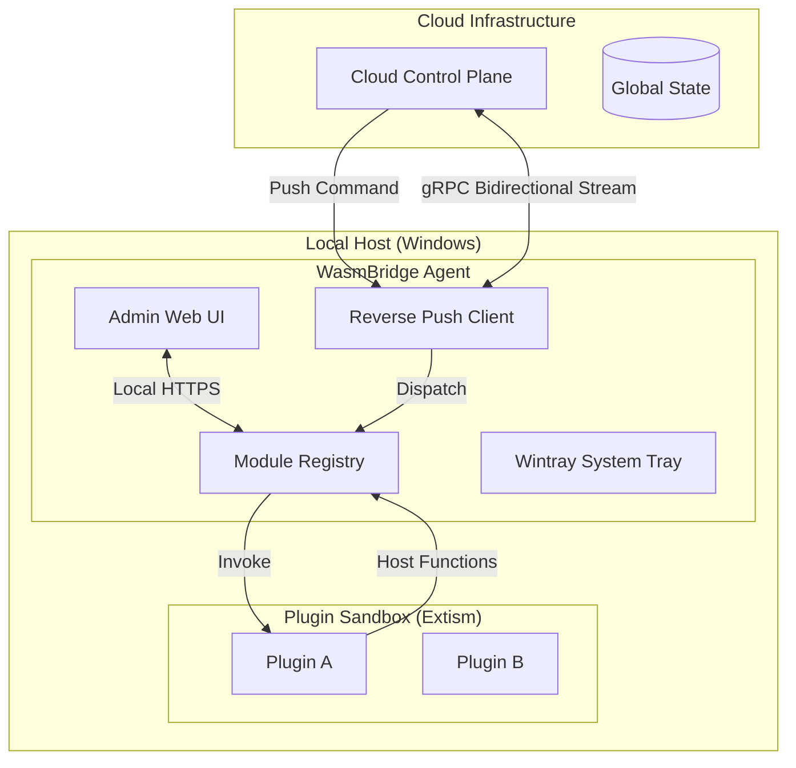

# WasmBridge: Unified Agent Documentation

WasmBridge is a modular, security-first agent framework designed for remote system management, monitoring, and automation. It enables developers to deploy sandboxed WebAssembly (WASM) plugins that can interact with the local host while remaining under the control of a centralized cloud plane.

## 🏗 High-Level Architecture

The system follows a "Reverse Push" model to traverse NAT and firewalls without requiring inbound port forwarding.

---

## 🧩 Key Components

### 1. WasmBridge Agent (`/src`)
The core orchestrator written in Rust. It manages the lifecycle of WASM plugins, provides an administrative web interface, and maintains connectivity with the cloud.
*   **Module Registry**: Handles hot-reloading of WASM files, persistence of plugin settings, and secure execution.
*   **Admin UI**: An Askama-templated dashboard powered by Axum, providing real-time monitoring and configuration.

### 2. Reverse Push Library (`/libs/reverse_push`)
A specialized gRPC client that maintains a persistent outbound connection to the cloud control plane.
*   **NAT Traversal**: Since the connection is outbound, it works behind most firewalls and corporate proxies.
*   **Command Routing**: Deserializes cloud instructions and routes them to specific plugins or host actions.

### 3. Wintray Framework (`/libs/wintray`)
A lightweight framework that combines the system tray icon with an embedded web server.
*   **User Interaction**: Allows quick access to the admin UI via the system tray.
*   **Self-Signed TLS**: Automatically manages local certificates to ensure secure HTTPS communication for the dashboard.

### 4. Plugin Protocol (`/crates/plugin-protocol`)
The shared "language" of the ecosystem.
*   **Unified Interface**: Defines standard `Request` and `Response` structures.
*   **Discovery**: Provides the metadata schema (`PluginInfo`) that allows the host to understand plugin capabilities automatically.

---

## 🔒 Security Model

WasmBridge is built with several layers of security:

1.  **Sandboxing**: Plugins run in an isolated WebAssembly runtime (Extism/Wasmer). They cannot access the filesystem, network, or system resources unless explicitly allowed via **Host Functions**.
2.  **Hardware Identification**: Each agent generates a unique, semi-stable `client_id` based on hardware parameters (CPU, RAM, OS) and hostname. This prevents spoofing and ensures unique identification in the cloud.
3.  **Encrypted Communication**: All traffic between the Agent and Cloud, as well as the Local UI, is encrypted via TLS.
4.  **Token-Based Auth**: The Reverse Push connection is secured using JWT (Bearer tokens) to authenticate agents against the control plane.

---

## 🛠 Developer Guide

### Creating a Plugin
Developers should use the [wasmbrigde-plugin-template](../wasmbrigde-plugin-template/README.md).

1.  **Define Metadata**: Implement `info()` to declare your plugin's name and settings.
2.  **Implement Logic**: 
    *   `handle_request()` for local web-based interactions.
    *   `execute_command()` for remote cloud-pushed tasks.
3.  **Build**: Target `wasm32-unknown-unknown`.
4.  **Deploy**: Upload via the WasmBridge Admin UI or place in the `AppData/WasmBridge/plugins` folder.

### Host Functions
Plugins can call back into the host using:
*   `get_date()`: Returns the current system time.
*   `insecure_get(url)`: Performs a network request on behalf of the plugin (subject to host-defined permissions).

---

## 🚀 Deployment

1.  **Build**: `cargo build --release`
2.  **Configure**: Edit `config.yml` (automatically created on first run) to set your `server_url` and `jwt_token`.
3.  **Run**: Launch the executable. It will minimize to the tray.

---

## 🗺 Roadmap
- [ ] Multi-platform support (Linux/macOS tray icons).
- [ ] Advanced RBAC for plugin host functions.
- [ ] Plugin-to-plugin direct communication.
- [ ] Local encrypted storage for plugin sensitive data.
